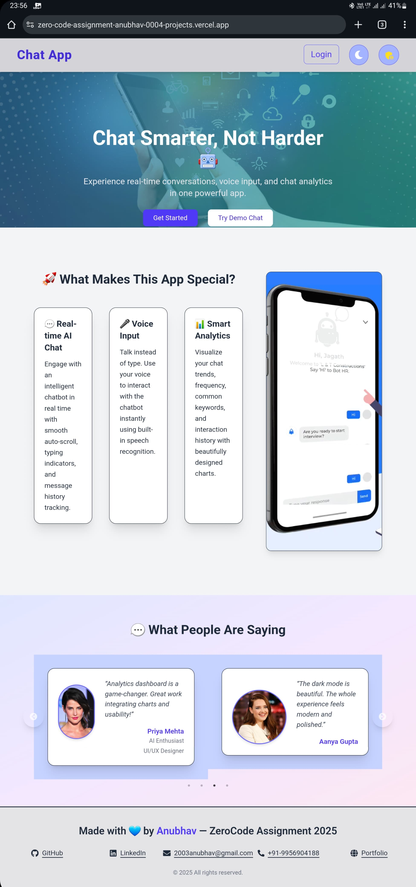
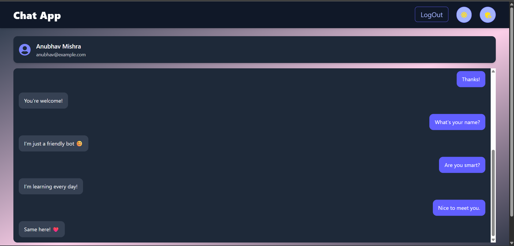
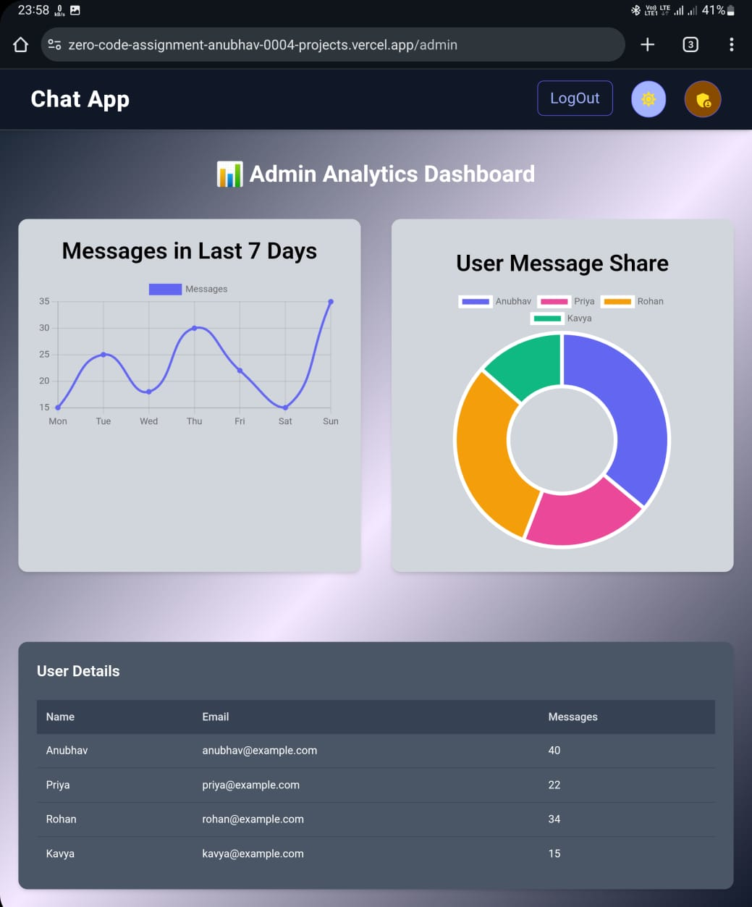

# 🧠 AI-Powered Chat & Analytics Dashboard

A **feature-rich modern web application** built with **React 19**, **Vite**, **Tailwind CSS**, **Framer Motion**, **Chart.js**, and **React Speech Recognition**.  
This project showcases modern frontend techniques like AI-like chatbot interaction, voice input, admin analytics, user management, and animated UI—all built for a frontend assignment.

🔗 **Live Demo:** [https://zero-code-assignment.vercel.app/](https://zero-code-assignment.vercel.app/)  
📁 **GitHub Repo:** [https://github.com/anubhav-0004/zerocode-fe-assignment](https://github.com/anubhav-0004/zerocode-fe-assignment)

---

## 🚀 Getting Started:

  - git clone https://github.com/anubhav-0004/zerocode-fe-assignment  
  - cd zerocode-fe-assignment  
  - npm install  
  - npm run dev  


---

## ✨ Features

- ✅ Beautiful **landing page** with animated header, services, and feedback sections.
- 💬 **Chat page** with:
  - Text + voice input via `react-speech-recognition`
  - Smooth animated chat bubbles using `framer-motion`
  - File upload and user profile display
  - Dynamic dummy AI replies
- 📊 **Admin analytics page**:
  - **Line chart**: Messages over 7 days (`chart.js`)
  - **Doughnut chart**: Messages per user
  - **Responsive user table** using `@tanstack/react-table`
- 🎨 Fully responsive & dark mode ready
- 🧪 Rich animations powered by `framer-motion`

---

## 🧾 Screenshots

### 🏠 Landing Page


### 💬 Chat Page


### 📊 Admin Dashboard


---

## 📂 Folder Structure

```bash
src/
│
├── pages/              
│   ├── Analytics.jsx     
│   ├── Chat.jsx         
│   ├── Home.jsx          
│   ├── Login.jsx        
│   ├── Register.jsx      
│   └── NoPage.jsx        
│
├── components/         
│   ├── Header.jsx        
│   ├── Footer.jsx       
│   ├── Services.jsx      
│   └── Feedback.jsx      
│
├── context/
│   └── theme.js         
│
└── public/             
    └── screenshots*
